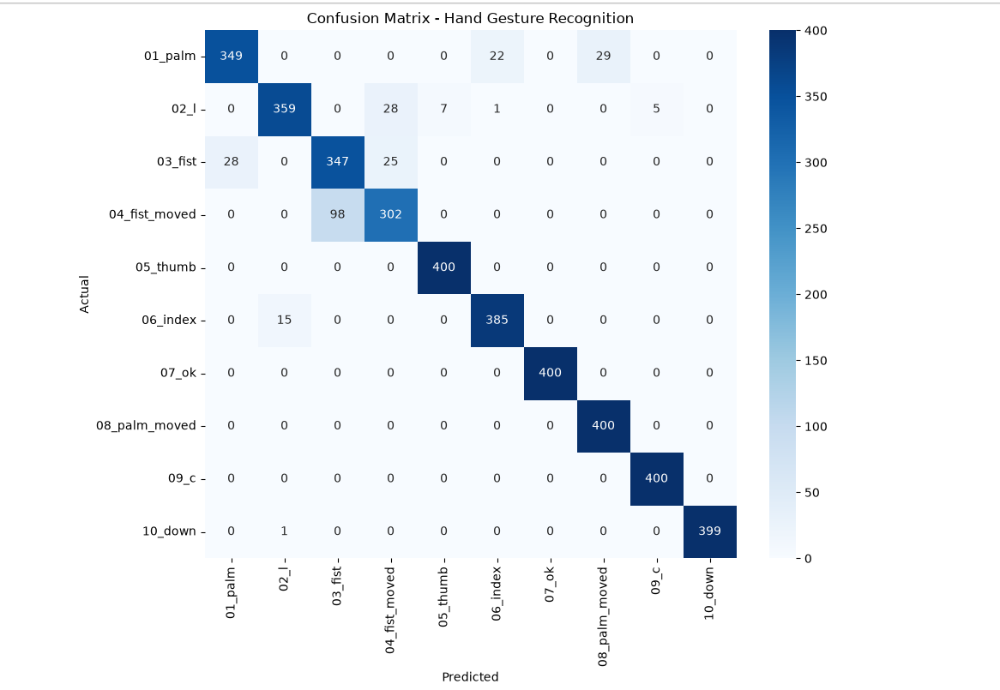
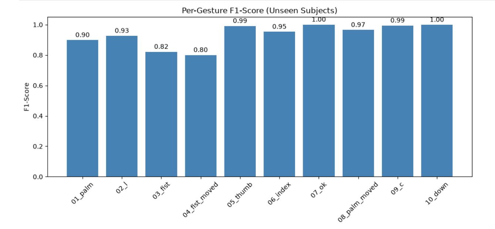

# PRODIGY_ML_04 — Hand Gesture Recognition using CNN

## 📌 Task
Develop a hand gesture recognition model that can accurately identify and classify different hand gestures from image data, enabling intuitive human-computer interaction and gesture-based control systems.

**Internship:** Prodigy InfoTech — Machine Learning Track (Task 04)

## 📂 Dataset
[LeapGestRecog](https://www.kaggle.com/gti-upm/leapgestrecog) — ~20,000 grayscale images across 10 subjects and 10 gesture classes (palm, fist, thumb, ok, index, c, down, etc.), captured using a Leap Motion infrared sensor.

## 🧠 Approach

1. **Preprocessing:** Images converted to grayscale, resized to 64×64, and pixel values normalized to [0,1].
2. **Model:** A Convolutional Neural Network (CNN) with 3 Conv2D + MaxPooling blocks, followed by Dense layers with Dropout for regularization.
3. **Train/Test Split — and an important lesson:**
   - **Naive random split** (images shuffled, 80/20 split) gave a misleadingly perfect ~100% validation accuracy. This happened due to **data leakage** — the same subjects' hands appeared in both training and test sets.
   - **Subject-based split** (training on subjects 00–07, testing entirely on unseen subjects 08–09) gave a far more honest ~78% accuracy, exposing real overfitting.
   - **Data augmentation** (rotation, shift, zoom) was then applied to improve generalization, raising accuracy on unseen subjects to **~94%**.

This progression — *naive split → exposing leakage → fixing it → improving generalization* — was the core learning outcome of this task, beyond just building a CNN.

## 📊 Results (on unseen test subjects)

**Overall accuracy: 94%**

| Gesture | F1-Score |
|---|---|
| 05_thumb, 07_ok, 09_c, 10_down | ~0.99–1.00 |
| 06_index, 08_palm_moved | ~0.95–0.97 |
| 01_palm, 02_l | ~0.90–0.93 |
| 03_fist, 04_fist_moved | ~0.80–0.82 |

The model struggles most distinguishing **static fist vs. moving fist** — an expected limitation, since motion-based gestures are hard to differentiate from a single still frame.

## 🔑 Key Learnings
- CNNs learn their own features from raw pixels, unlike manual feature engineering (e.g., HOG in Task 3).
- How a train/test split is constructed can completely change (and inflate) reported accuracy — subject/group-based splits matter for honest evaluation.
- Data augmentation meaningfully improves generalization without needing more raw data.
- Domain shift: a model trained on infrared sensor images is not expected to generalize well to regular webcam footage without retraining.

## 🛠️ Tech Stack
Python, TensorFlow/Keras, OpenCV, scikit-learn, NumPy, Matplotlib, Seaborn

## 📁 Files
- `gesture_recognition.ipynb` — full notebook (data loading, model building, training, evaluation)
- `gesture_recognition_model.h5` — saved trained model